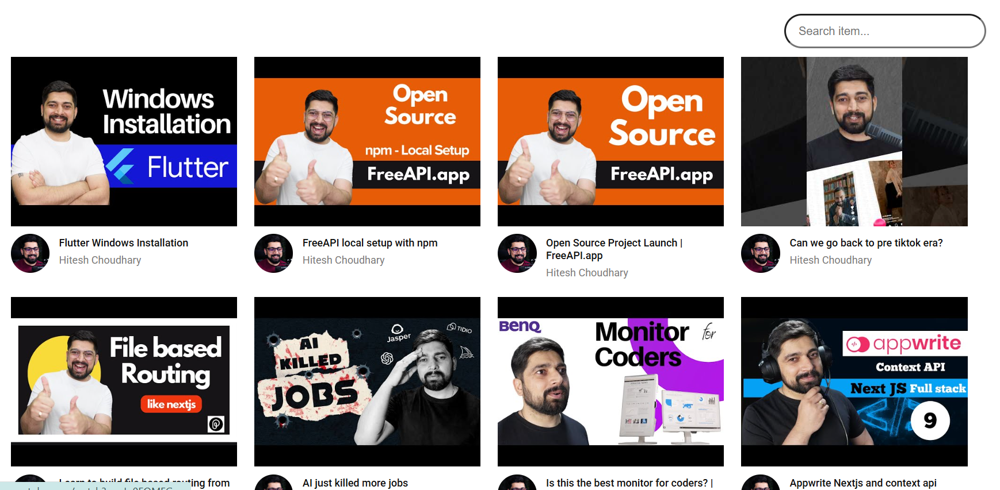
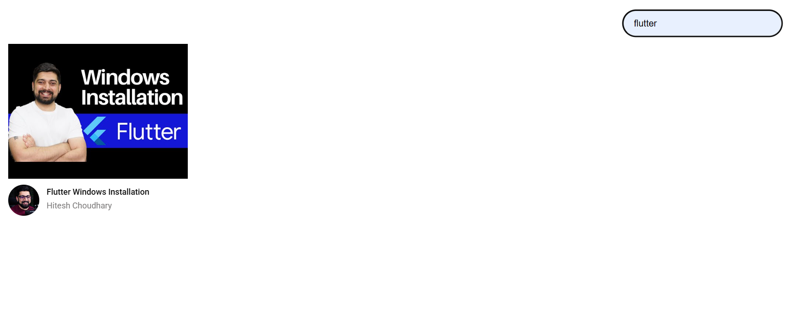

🎬 YouTube Video Listing

Full Video List Screenshot

Filter Screenshot

📌 Overview
This project is a YouTube-style video listing page that fetches and displays videos from the FreeAPI YouTube endpoint.

API Endpoint
GET https://api.freeapi.app/api/v1/public/youtube/videos

✨ Features
✅ Fetch and display YouTube videos 📺
✅ Show thumbnails, titles, and channel names 🏷️
✅ Click on a video to open it in YouTube 🔗
✅ Search bar to filter videos 🔍 (frontend filtering)
✅ Responsive grid layout for better UI 🎨

🎯 Usage
▶️ Browse the video list
🔍 Use the search bar to filter videos
🎥 Click on a video to watch it on YouTube

Deploy Link